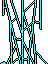
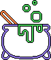
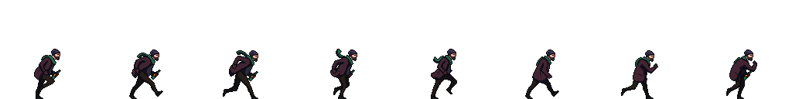
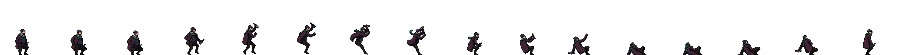
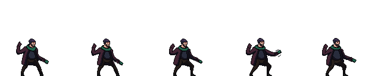

# **Nine-Shions**

## _Game Design Document_

---

##### **Copyright notice / author information / boring legal stuff nobody likes**

* Santiago Arista Viramontes
* Darío Peña Mariano
* Rebeca Dávila Araiza

##
## _Index_

---

1. [Index](#index)
2. [Game Design](#game-design)
    1. [Summary](#summary)
    2. [Gameplay](#gameplay)
    3. [Mindset](#mindset)
3. [Technical](#technical)
    1. [Screens](#screens)
    2. [Controls](#controls)
    3. [Mechanics](#mechanics)
4. [Level Design](#level-design)
    1. [Themes](#themes)
        1. Ambience
        2. Objects
            1. Ambient
            2. Interactive
        3. Challenges
    2. [Game Flow](#game-flow)
5. [Development](#development)
    1. [Abstract Classes](#abstract-classes--components)
    2. [Derived Classes](#derived-classes--component-compositions)
6. [Graphics](#graphics)
    1. [Style Attributes](#style-attributes)
    2. [Graphics Needed](#graphics-needed)
7. [Sounds/Music](#soundsmusic)
    1. [Style Attributes](#style-attributes-1)
    2. [Sounds Needed](#sounds-needed)
    3. [Music Needed](#music-needed)
8. [Schedule](#schedule)

## _Game Design_

---

### **Summary**

Nineshions is a spooky plataforming roguelite game where a monster hunter enters a mysterious mansion where monsters come out to haunt people every Halloween. There, the hunter must defeat all the monsters in the eight rooms of the mansion. It’ll be no easy task inside a dark, big, and dangerous mansion, so that’s why the he can receive ocassional help from an assistant do hurt some enemies, a flashlight to look in the dark and a powerup to double jump in the platforms. Through the explorations of the mansion, he must find eight keys to enter the ninth room, where the boss room is located, and finally defeat to stop his plans and save Halloween.

### **Gameplay**

The monster hunter can be controled by using the keys w,a,s,d to move left and right, jump and get down a platform.
The player must navigate through eight rooms inside the mansion, fight different monsters, and collect eight keys to access the final boss room. The challenge comes from resource management (limited lives, losing keys upon death) and strategic movement (using the double jump and the helper).

### **Mindset**

We want to make the player feel scared, helpless and confused at the start of the game, in a mysterious mansion with some dark rooms that change their order after death and has monsters haunting through them. However, as the player keeps defeating monsters, they can gain experience to increase their damage and deafeting the monster easier. The player must also be cautious because they can loose this experience and the keys collected through the rooms if they die, giving them more challenges and make them use their own skill, with the help of the items, to clear the mansion.

## _Technical_

---

### **Screens**

1. Title Screen
   Settings
   Play buttom
   Logo Game
2. Gameplay Screen
    1. Life section
    2. Key section
    3. Game section
    4. Pause Container
        Continue
        Settings
        Leave game
    5. Map Container
        Rooms
        Boss Romm
        Tittle
        Actual Room
        Rooms completed
3.- Settings Screen
      General volume
      Restart progress
4.- Credits Screen
       Game Credits

       
### **Controls**
- W-jump/Double Jump
- A-Move left
- D-Move right
- S-Bend
- M-Unfold map
- P-Pause Menu
- k-Fire

### **Mechanics**

#### Scenarios mechanics:
- The first room where the player respawns is the safe room, where there are no enemies around and you can find the weapons arsenal to unlock new weapons depending on your game score.
- When you open the map, the game doesn't stop. So, the player must open it in special cases or in places with fewer enemies.
- There are three weapons at the safe room, which have diferrent fire mechanics and you can unlock them as you progress through the game.

#### Rules:
1. The player must explore all the eight rooms to get the keys and enter the boss’s room
2. The player has three lives in total, and after he dyes, he must start the level from the begining
3. The player can explore the rooms however they want through the different exits inside a room. Some of them can be accessed by jumping through platforms
4. The player has a default weapon that allows him to shoot at the enemies and they can arrange its direction.
5. After defeating an enemy, they will always gain experience level, which increases the damage the player can do withthe gun. This experience goes 0 after the player dyes.
6. The last monster in each room will have a key. So the player must defeat all the monsters in each room until they get the key and get eight keys in total.
7. A random monster can grant the player an item after defeating them:
   - Flashlight: It allows you to get a wider range of sight inside a dark room, and it’ll still be active even in iluminated rooms. If the player doesn’t has the flashlight, their range of sight is shorter in darkr rooms.
   - The assistant: It appears next to the player to shoot at some enemies. However, its range attack is shorter than the player and does less damage.
   - Double Jump: it allows the player to make a second jump while they are in the air.
8. These items can be gained once through all of the game and can be kept by the player even after dying.
9. Once the player has all the keys, they must find the secret door that leads to the final boss.

## _Level Design_

---

_(Note : These sections can safely be skipped if they&#39;re not relevant, or you&#39;d rather go about it another way. For most games, at least one of them should be useful. But I&#39;ll understand if you don&#39;t want to use them. It&#39;ll only hurt my feelings a little bit.)_

### **Assets**
In the video game, we have assets inspired by monsters and the Halloween festivity. The assets are as follows:

1. scenery
    1. Tiles (Complete assets list -> [Tiles](https://github.com/santiagoarista/Videogames-team/tree/main/assets/bullets/Laser%20Sprites/) )

        |  |  | |   |  | | 
     

    1. Decorations (Complete assets list -> [Decoration](https://github.com/santiagoarista/Videogames-team/tree/main/assets/escenario/decoraciones) )

        |  |  | |  
        |  | | | | 
    1. Bullet (Complete assets list -> [Bullets](https://github.com/santiagoarista/Videogames-team/tree/main/assets/bullets/Laser%20Sprites/) )

        |  |  | )| 
     
        |  | 
        
1. Characters
    1. Main character (Complete assets list -> [Main Character](https://github.com/santiagoarista/Videogames-team/tree/main/assets/character/main_character) )

          
          
          

### **Themes**

1. Haunted Mansion
    1. Mood
        1. Dark, calm, foreboding
    2. Objects
        1. _Ambient_
            1. skeletons
            2. Beams of moonlight
            3. tables
            4. libraries
            5. cabinets
        2. _Interactive_
            1. Wolves
            2. Goblins
            3. Rocks

_(example)_

### **Game Flow**

1. Player starts in forest
2. Pond to the left, must move right
3. To the right is a hill, player jumps to traverse it (&quot;jump&quot; taught)
4. Player encounters castle - door&#39;s shut and locked
5. There&#39;s a window within jump height, and a rock on the ground
6. Player picks up rock and throws at glass (&quot;throw&quot; taught)
7. … etc.

_(example)_

## _Development_

---

### **Abstract Classes / Components**

1. BasePhysics
    1. BasePlayer
    2. BaseEnemy
    3. BaseObject
2. BaseObstacle
3. BaseInteractable

_(example)_

### **Derived Classes / Component Compositions**

1. BasePlayer
    1. PlayerMain
    2. PlayerUnlockable
2. BaseEnemy
    1. EnemyWolf
    2. EnemyGoblin
    3. EnemyGuard (may drop key)
    4. EnemyGiantRat
    5. EnemyPrisoner
3. BaseObject
    1. ObjectRock (pick-up-able, throwable)
    2. ObjectChest (pick-up-able, throwable, spits gold coins with key)
    3. ObjectGoldCoin (cha-ching!)
    4. ObjectKey (pick-up-able, throwable)
4. BaseObstacle
    1. ObstacleWindow (destroyed with rock)
    2. ObstacleWall
    3. ObstacleGate (watches to see if certain buttons are pressed)
5. BaseInteractable
    1. InteractableButton

_(example)_

## _Graphics_

---

### **Style Attributes**

What kinds of colors will you be using? Do you have a limited palette to work with? A post-processed HSV map/image? Consistency is key for immersion.

What kind of graphic style are you going for? Cartoony? Pixel-y? Cute? How, specifically? Solid, thick outlines with flat hues? Non-black outlines with limited tints/shades? Emphasize smooth curvatures over sharp angles? Describe a set of general rules depicting your style here.

Well-designed feedback, both good (e.g. leveling up) and bad (e.g. being hit), are great for teaching the player how to play through trial and error, instead of scripting a lengthy tutorial. What kind of visual feedback are you going to use to let the player know they&#39;re interacting with something? That they \*can\* interact with something?

### **Graphics Needed**

1. Characters
    1. Human-like
        1. Goblin (idle, walking, throwing)
        2. Guard (idle, walking, stabbing)
        3. Prisoner (walking, running)
    2. Other
        1. Wolf (idle, walking, running)
        2. Giant Rat (idle, scurrying)
2. Blocks
    1. Dirt
    2. Dirt/Grass
    3. Stone Block
    4. Stone Bricks
    5. Tiled Floor
    6. Weathered Stone Block
    7. Weathered Stone Bricks
3. Ambient
    1. Tall Grass
    2. Rodent (idle, scurrying)
    3. Torch
    4. Armored Suit
    5. Chains (matching Weathered Stone Bricks)
    6. Blood stains (matching Weathered Stone Bricks)
4. Other
    1. Chest
    2. Door (matching Stone Bricks)
    3. Gate
    4. Button (matching Weathered Stone Bricks)

_(example)_

## _Sounds/Music_

---

### **Style Attributes**

Again, consistency is key. Define that consistency here. What kind of instruments do you want to use in your music? Any particular tempo, key? Influences, genre? Mood?

Stylistically, what kind of sound effects are you looking for? Do you want to exaggerate actions with lengthy, cartoony sounds (e.g. mario&#39;s jump), or use just enough to let the player know something happened (e.g. mega man&#39;s landing)? Going for realism? You can use the music style as a bit of a reference too.

 Remember, auditory feedback should stand out from the music and other sound effects so the player hears it well. Volume, panning, and frequency/pitch are all important aspects to consider in both music _and_ sounds - so plan accordingly!

### **Sounds Needed**

1. Effects
    1. Soft Footsteps (dirt floor)
    2. Sharper Footsteps (stone floor)
    3. Soft Landing (low vertical velocity)
    4. Hard Landing (high vertical velocity)
    5. Glass Breaking
    6. Chest Opening
    7. Door Opening
2. Feedback
    1. Relieved &quot;Ahhhh!&quot; (health)
    2. Shocked &quot;Ooomph!&quot; (attacked)
    3. Happy chime (extra life)
    4. Sad chime (died)

_(example)_

### **Music Needed**

1. Slow-paced, nerve-racking &quot;forest&quot; track
2. Exciting &quot;castle&quot; track
3. Creepy, slow &quot;dungeon&quot; track
4. Happy ending credits track
5. Rick Astley&#39;s hit #1 single &quot;Never Gonna Give You Up&quot;

_(example)_

## _Schedule_

---

_(define the main activities and the expected dates when they should be finished. This is only a reference, and can change as the project is developed)_

1. develop base classes
    1. base entity
        1. base player
        2. base enemy
        3. base block
  2. base app state
        1. game world
        2. menu world
2. develop player and basic block classes
    1. physics / collisions
3. find some smooth controls/physics
4. develop other derived classes
    1. blocks
        1. moving
        2. falling
        3. breaking
        4. cloud
    2. enemies
        1. soldier
        2. rat
        3. etc.
5. design levels
    1. introduce motion/jumping
    2. introduce throwing
    3. mind the pacing, let the player play between lessons
6. design sounds
7. design music

_(example)_
