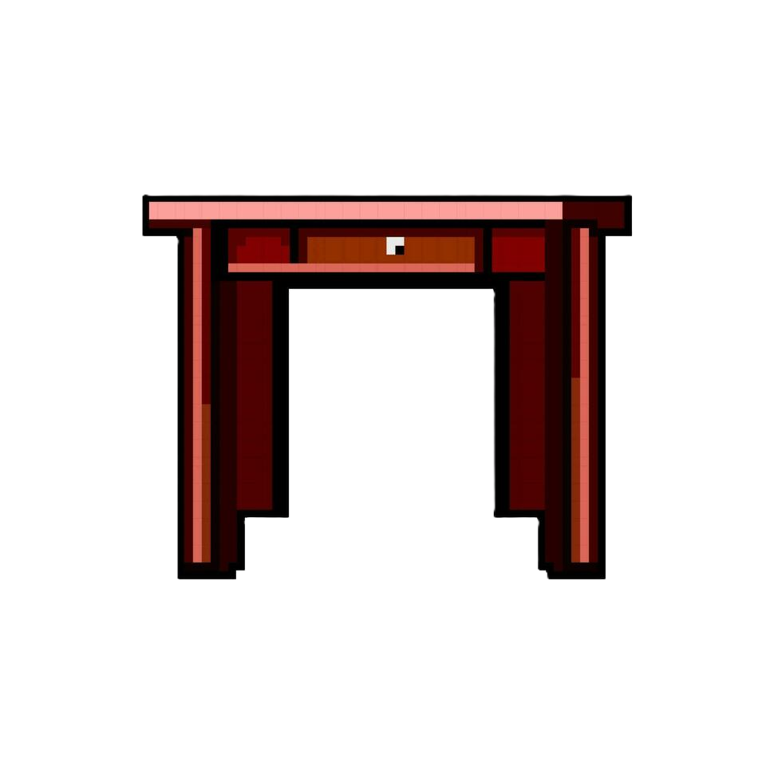

# **Nine-Shions**

## _Documento de Diseño del Juego_

Equipo Ghostbusters

- Santiago Arista Viramontes
- Darío Peña Mariano
- Rebeca Dávila Araiza

## _Índice_

1. [índice](#Índice)
1. &#x20;[Diseño del juego](#Diseño_del_Juego)
   - [Resumen](#Resumen)
   - [Jugabilidad](#Jugabilidad)
   - [Mentalidad](#Mentalidad)
1. &#x20;[Apectos técnicos](#Aspectos_técnicos)
   - [Pantallas](#Pantallas)
   - [Controles](#Controles)
   - [Mecánicas](#Mecánicas)
1. [Diseño de Nivel](#diseño-de-niveles)
   1. [Temas](#temas)
      1. Ambiente
      2. Objetos
         1. Ambientales
         2. Interactivos
      3. Desafíos
   2. [Flujo del Juego](#flujo-del-juego)
1. [Desarrollo](#Desarrollo)
   1. [Clases Abstractas](#clases-abstractas--componentes)
   2. [Clases Derivadas](#clases-derivadas--composiciones-de-componentes)
1. [Gráficos](#gráficos)
   1. [Atributos de Estilo](#atributos-de-estilo)
   2. [Gráficos Necesarios](#gráficos-necesarios)
1. [Sonidos/Música](#sonidosmúsica)
   1. [Atributos de Estilo](#atributos-de-estilo-1)
   2. [Sonidos Necesarios](#sonidos-necesarios)
   3. [Música Necesaria](#música-necesaria)
1. [Calendario](#calendario)

## _Diseño_del_Juego_

### **Resumen**

Nineshions es un juego de plataformas roguelite de terror en el que un cazador de monstruos entra en una mansión misteriosa de donde emergen criaturas para asustar a la gente cada Halloween. El cazador debe derrotar a todos los monstruos en las ocho habitaciones de la mansión. No será una tarea fácil en un lugar oscuro, grande y peligroso, por lo que contará con la ayuda ocasional de un asistente que dañará a algunos enemigos, una linterna para iluminar en la oscuridad y una mejora que le permitirá hacer un doble salto en las plataformas. A medida que explore la mansión, deberá encontrar ocho llaves para entrar en la novena habitación, donde se encuentra el jefe final, y derrotarlo para salvar Halloween.

### **Jugabilidad**

El cazador de monstruos se controla con las teclas W, A, S y D para moverse a la izquierda, derecha, saltar y descender de una plataforma.
El jugador debe navegar a través de ocho habitaciones dentro de la mansión, luchar contra diferentes monstruos y recolectar ocho llaves para acceder a la sala del jefe final. El desafío radica en la gestión de recursos (vidas limitadas, pérdida de llaves al morir) y en el movimiento estratégico (usando el doble salto y el asistente).

### **Mentalidad**

Queremos que el jugador se sienta asustado, indefenso y confundido al comienzo del juego, en una mansión misteriosa con algunas habitaciones oscuras cuyo orden cambia tras la muerte y donde los monstruos acechan. Sin embargo, a medida que el jugador derrota monstruos, gana experiencia para aumentar su daño y derrotarlos más fácilmente. El jugador también debe ser cauteloso, ya que puede perder esta experiencia y las llaves recolectadas si muere, lo que le presenta más desafíos y lo obliga a usar su propia habilidad, con la ayuda de los objetos, para limpiar la mansión.

## _Aspectos_técnicos_

### **Pantallas**

1. Pantalla de Título
   - Logo del Juego
   - Botón de Jugar
   - Boton de registro
   - Boton de estadisticas del juego
2. Pantalla de Juego
   - Sección de Vida
   - Sección de Llaves
   - Sección de Juego
   - Contenedor de Pausa
     - Continuar
     - Configuración
     - Salir del Juego
   - Contenedor del Mapa
     - Habitaciones
     - Sala del Jefe
     - Título
     - Habitación Actual
     - Habitaciones Completadas
3. Pantalla de Configuración Rapida
   - Volumen General
   - Reiniciar Progreso
4. Pantalla de GAME OVER
   - Volver a jugar
   - Salir del juego
5. Pantalla de Créditos
   - Créditos del Juego

### **Controles**

- w - Saltar / Doble Salto
- a - Moverse a la Izquierda
- d - Moverse a la Derecha
- s - Agacharse
- m - Desplegar Mapa
- p - Menú de Pausa
- k - Disparar
- l - Cambiar de arma

### **Mecánicas**

#### Mecánicas de Escenarios:

- La primera habitación donde reaparece el jugador es la habitación segura, donde no hay enemigos y se puede encontrar un arsenal de armas para desbloquear nuevas según el puntaje del juego.
- Al abrir el mapa, el juego no se detiene, por lo que el jugador debe abrirlo en momentos estratégicos.
- Hay tres armas en la habitación segura, cada una con diferentes mecánicas de disparo, y se pueden desbloquear a medida que se avanza en el juego.

#### Reglas:

1. El jugador debe explorar las ocho habitaciones para obtener las llaves y entrar en la sala del jefe.
2. Tiene tres vidas en total; al perderlas, debe reiniciar el nivel.
3. Puede explorar las habitaciones libremente a través de las diferentes salidas dentro de una habitación.
4. Tiene un arma predeterminada con la que puede disparar a los enemigos y dirigir sus disparos.
5. Derrotar enemigos otorga experiencia, aumentando el daño del arma. Esta experiencia se reinicia si el jugador muere.
6. El último monstruo en cada habitación tendrá una llave, por lo que el jugador debe derrotar a todos los monstruos en cada habitación hasta obtenerlas.
7. Un monstruo aleatorio puede otorgar un objeto al ser derrotado:
   - Linterna: Aumenta el rango de visión en habitaciones oscuras.
   - Asistente: Dispara a algunos enemigos con un rango de ataque menor y menor daño.
   - Doble Salto: Permite hacer un segundo salto en el aire.
8. Estos objetos se obtienen una sola vez y permanecen incluso tras la muerte.
9. Una vez obtenidas todas las llaves, el jugador debe encontrar la puerta secreta que conduce al jefe final.

## _Diseño de nivel_

**Assets gráficos:**

En el videojuego tenemos assets inspirados por mounestros de la literatura clásica de terror y la festividad de Hallowen, los assets son los siguientes:

1.  Escenario

    1.  Tiles (Lista completa de tiles -> [Tiles](https://github.com/santiagoarista/Videogames-team/tree/main/assets/bullets/Laser%20Sprites/)

     | | |  | | |

    1.  Decoraciones (Lista completa de assets -> [Decoration](https://github.com/santiagoarista/Videogames-team/tree/main/assets/escenario/decoraciones) )

        |  | | |
        |  | | | |

        |
         |

    1.  Balas (Lista completa de assets -> [Bullets](https://github.com/santiagoarista/Videogames-team/tree/main/assets/bullets/Laser%20Sprites/) )

        |  | | )|

        |  |

2.  Assets de sonido

    **Música**
    La música del videojuego tiene que estar inspirada en música de hallowen

    1. Los assets musicales que utilizamos incluyen tres pistas, ya que en el videojuego habrá tres momentos musicalizados. Estos momentos son:
       1. Pantalla de titulos (inicio): "Beetlejuice Beetlejuice Soundtrack | Main Title Theme - Danny Elfman "
          [Title Screen Music](https://www.youtube.com/watch?v=C9vv3-AYxkw)
       2. Cuartos normales: "Goosebumps · Danny Elfman"
          [Regular Rooms Music](https://www.youtube.com/watch?v=ztnifjaFDxQ)
       3. Cuarto del jefe final: "Spooky, Scary Skeletons (Undead Tombstone Remix) · Andrew Gold"
          [Final Boss room Music](https://www.youtube.com/watch?v=UWR4aTdMbzw)

## _Gráficos_

### **Atributos de estilo**

1. Colores neón vibrantes sobre fondos oscuros, creando un fuerte contraste.
2. Efectos de partículas intensos con iluminación.
3. Diseño minimalista pero estilizado, con formas geométricas y siluetas definidas.
4. Ambiente distópico con elementos sobrenaturales de Halloween.
5. Uso de formas con degradado para simular iluminación.

**Personajes**

1. Personaje principal (Lista completa de assets -> [Main Character](https://github.com/santiagoarista/Videogames-team/tree/main/assets/character/main_character) )

   
   
   

2. Borradores de los cuartos

   1. Cuartos:
      -Jefe final
      
      -Spawn
      

   2. Otras pantallas dentro del juego:
      -Panralla de pausa
      
      -Pantalla de mapa
      

---

## Desarrollo

### **Clases Abstractas / Componentes**

1. Sprite
   - Jugador
   - Enemigo1
   - Enemigo2
   - Objetos
   - Puerta
2. Cuarto
3. ConexionCuarto
4. ControladorDeAudio
5. ContenedorCuarto

### **Clases Derivadas / Componentes**

1. #### Jugador, derivada de Sprite
   - ##### Atributos
      * EnTransicion
      * visible
      * countdown
      * countdownDelay
      * bulletController
      * posicion
      * velocidad
      * lados
      * gravedad
      * bloques de colision
      * puertas
      * vidas
      * parpadeo
      * parapdeo Intervalo
      * parpadeo Duracion
      * llaves
      * objetos
   - ##### Metodos
      * BajarVidas
      * DibujarVidas
      * DibujarLlaves
      * Actualizar
      * Disparar
      * CambiarSprite
      * ActualizarHitbox
      * ChecarColisionesHorizontales
      * ChecarColisionesVerticales
      * RecibirDaño
      * RecibirDañoBalaEnemigo
      * GameOver
      * AplicarGravedad
2. #### Enemigo1, derivada de Sprite
   - ##### Atributos
      * indice
      * salud
      * bulletController
      * posicion
      * velocidad
      * lados
      * gravedad
      * bloques de colision
      * puertas
      * disparosJugador
      * ImagenVidas
   - ##### Metodos
      * RecibirDaño
      * Actualizar
      * Disparar
      * CambiarSprite
      * ActualizarHitbox
      * ChecarColisionesHorizontales
      * ChecarColisionesVerticales
      * AplicarGravedad
      * RecibirGolpe
3. #### Enemigo2, derivada de Sprite
   - ##### Atributos
      * indice
      * salud
      * EnemigobulletController
      * posicion
      * delayBala
      * velocidadBala
      * velocidadEnemigo
      * direccion
      * velocidad
      * lados
      * umbralDisparo
      * direccionDisparo
      * movimiento
      * umbralesMovimiento
      * bloques de colision
      * puertas
      * estatico
      * disparosJugador
      * imagenVida
   - ##### Metodos
      * RecibirDaño
      * Actualizar
      * Disparar
      * CambiarSprite
      * ActualizarHitbox
      * ChecarColisionesHorizontales
      * ChecarColisionesVerticales
      * RecibirGolpe
4. #### Items, derivada de Sprite
   - ##### Atributos
      * idObjeto
      * tipo
      * posicion
      * velocidad
      * lados
      * gravedad
      * bloques de colision
   - ##### Metodos
      * Actualizar
      * ActualizarHitbox
      * ChecarColisionesHorizontales
      * ChecarColisionesVerticales
      * AplicarGravedad
5. #### Linterna, derivada de Item
   - ##### Atributos
      * idObjeto
      * largo
      * ancho
   - ##### Metodos
      * Dibujar
      * ActualizarHitbox
6. #### Asistente, derivada de Item
   - ##### Atributos
      * frameRate
      * imgFuente
      * idObjeto
      * tipo
      * x
      * y
   - ##### Metodos
      * CambiarSprite
      * ActualizarHitbox
5. #### Botas, derivada de Item
   - ##### Atributos
      * idObjeto
      * largo
      * ancho
   - ##### Metodos
      * Dibujar
      * ActualizarHitbox
6. #### Arma, derivada de Item
   - ##### Atributos
      * idObjeto
      * tipo
      * imgFuente
      * x
      * y
      * idArma
      * largo
      * ancho
   - ##### Metodos
      * Actualizar
      * Dibujar
      * ActualizarHitbox

### **Temática**

1. Mansión embrujada
   1. Tema
      1. Oscura, misteriosa, impredecible
   2. Objetos
      1. _Ambiente_
         1. Luces neón
         2. Mosaicos
         3. Atúdes
         4. Mesas
         5. Libreros
         6. Lockers
         7. Cajas
      2. _Interactuables_
         1. Esquelotos
         2. Fantasmas
         3. Murcielagos
         4. Llaves
         5. Itemas recogibles con ayudas al jugafor como doble salto, asistente, linterna

### **Flujo de juego**

1. El jugador comienza en la sala de reaparición.
2. En esa sala, el jugador puede encontrar tres armas para usar, pero al principio o después de reaparecer, solo podrá usar la primera (se enseñan los "controles de movimiento").
3. Hay cuatro salidas abiertas en esa sala, el jugador puede ir hacia cualquier dirección que desee.
4. En cualquiera de las habitaciones en las que el jugador decida entrar, un grupo de enemigos dentro comenzará a atacarlo.
5. El jugador dispara a los enemigos para eliminarlos.
6. El último enemigo que el jugador derrote soltará una llave que el jugador debe recoger.
7. Luego, el jugador debe continuar hacia la siguiente habitación que decida explorar.
8. Algunos monstruos otorgarán un ítem al jugador para facilitar el juego, el cual solo se puede recoger una vez. El jugador puede tener estos ítems permanentemente.
9. Eventualmente, el jugador encontrará la puerta al jefe final, pero debe recolectar las ocho llaves para poder entrar.
